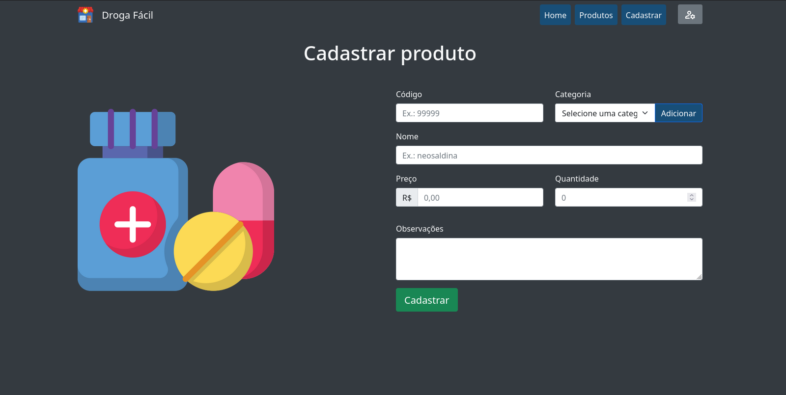

# drogstore-project

## Baixando a aplicação
```
git clone https://github.com/iwtrainingbr/php-07-drugstore.git
cd php-07-drugstore
```


## Instalação
Para instalar as dependencias

```
php composer.phar install`
```


## Configurar o banco de dados
Altere os parametros em `/src/Connection/Connection.php`, crie um banco de dados no seu MySQL.


E execute a linha abaixo:
```
php vendor/bin/doctrine orm:schema-tool:update --force
```

## Executando a aplicação
`php -S localhost:8000 -t public`



